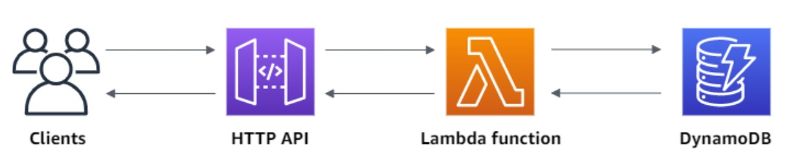

# Leitner - Projeto de Arquitetura de Software

## 1. Grupo
### 1.1 Integrantes: 
    
- Arthur Naves Pedroso
- Caio Henrique Portella
- Luiz Eduardo Ramirez
- Mauricio Macedo Villarnobo

## 2. Requisitos
1. carregar um conjunto contendo 10 flashcards, pelo menos;
2. virar um flascard a cada solicitação do usuário;
3. passar para outro flashcard a pedido do usuário;
4. sortear um flashcard, quando o usuário desejar;
5. mostrar quantos flashcards o usuário corretamente se lembrou;
6. suportar a inserção e remoção de flashcards;
7. ser executado em desktops e celulares;
8. permitir que um usuário troque flashcards com outro usuário;
9. a aplicação deverá “animar” um flashcard sempre que ele for virado;
10. basear-se na proposta de Leitner1 quando do sorteio de flashcards.

---

## 3. Ferramentas
### 3.1 Desenvolvimento de software:


- **Vantagens:** 
  1. Facilidade na distribuição da aplicação para múltiplas plataformas;
  2. Editor _potente_ que dá amplo suporte para assets 2D e 3D;
- **Desvantagens:** O motor da Unity é muito grande, o que resulta em executáveis com tamanhos excessivos;

<br/><br/>

 


<br/><br/>

- Vantagens: 
  1. Serverless;
  2. Automaticamente escalonável;
  3. _Muito_ simples de utilizar;
- Desvantagens: Torna-se um custo após certo período;
<br></br>

- Ferramentas organizacionais:

 
 
 
 

---

## 4 Software

### 1. MonoSinglenton

```cs
    public abstract class MonoSingleton<SingletonClass> : MonoInstance where SingletonClass : MonoSingleton<SingletonClass>
    {
        [SerializeField] private bool m_dontDestroyOnLoad;
        
        private static SingletonClass s_instance;

        public static SingletonClass Instance 
        {
            get 
            {
                if (s_instance == null)
                {
                    s_instance = FindObjectOfType<SingletonClass>();
                }
                if (s_instance == null)
                {
                    Debug.LogWarning("Nenhuma instancia do objeto encontrada, instanciando novo objeto...");
                    s_instance = new GameObject(typeof(SingletonClass).Name).AddComponent<SingletonClass>();
                }
                return s_instance;
            }
        }

        public bool WillNotDestroyOnLoad { get { return m_dontDestroyOnLoad; } }

        protected virtual void Awake()
        {
            if (s_instance != null) 
            {
                Debug.LogError("More than one instance of "+ name +" found!!!");
                Destroy(gameObject);
                return;
            }
            s_instance = (SingletonClass)this;
            if(m_dontDestroyOnLoad) DontDestroyOnLoad(gameObject);
        }
    }
```
### 2. PlayerDataManager

```cs
public class PlayerDataManager : MonoSingleton<PlayerDataManager>
{
    private void CheckUsrRegistry();
    private void RegisterUserOnServer(int _requests = 0);
    private void TryToDownloadAndMergeDeckData(Action<bool> _mergeResult, string _usrID, int _requests = 0);
    private void TryToDownloadDeckData(int _requests = 0);
    private Dictionary<string, FlashcardData> CreateFlashcardDictionary(DeckData _deck);
    private void AddDeckDataToDict(Dictionary<string, FlashcardData> _dict, DeckData _deckData);
    private DeckData DictionaryToDeck(Dictionary<string, FlashcardData> _dict);

    public void SetFlashcard(string _oldKey, FlashcardData _flashcard);
    public FlashcardData GetFlashcard(string _key);
    public void AddNewFlashcard(FlashcardData _flashcard);
    public void DeleteFlashcard(string _key);       
    public void SaveFlashcards(Action _onUploadCompleted);
    public void ResetFlashcards();
    public void MergeDecks(string _usrId, Action<bool> _mergeDeckResultCB);
}
```


### 3. ServerComs

```cs

        public static IEnumerator GetUserDeckAsync(string _usrID, Action<DeckData, UnityWebRequest.Result> _onDownloadFinished, Action<float> _onDownloadUpdate)
        {
            DeckData deckData = null;
            using (UnityWebRequest getRequest = UnityWebRequest.Get(s_servrUrl + "/" + _usrID))
            {
                DownloadHandler downloadHan;
                getRequest.SendWebRequest();

                while (!getRequest.isDone)
                {
                    _onDownloadUpdate(getRequest.downloadProgress);
                    yield return null;
                }

                if (getRequest.error != null)
                {
                    Debug.LogError(getRequest.error);

                    _onDownloadFinished(deckData, getRequest.result);
                }
                else
                {
                    downloadHan = getRequest.downloadHandler;

                    deckData = JsonUtility.FromJson<PlayerDataGetReponse>(downloadHan.text).Item.deck;

                    _onDownloadFinished(deckData, getRequest.result);
                }
            }
        }

        public static IEnumerator SetUserDeckAsync(string _usrID, DeckData _usrData, Action<UnityWebRequest.Result> _onUploadFinished, Action<float> _onUploadUpdate)
        {
            PlayerData playerData = new PlayerData(_usrID, _usrData);
            using (UnityWebRequest setRequest = UnityWebRequest.Put(s_servrUrl, JsonUtility.ToJson(playerData)))
            {

                setRequest.SetRequestHeader("Content-Type", "application/json");
                setRequest.SendWebRequest();

                while (!setRequest.isDone)
                {
                    _onUploadUpdate(setRequest.uploadProgress);
                    yield return null;
                }

                if (setRequest.error != null)
                {
                    Debug.LogError(setRequest.error);
                }

                _onUploadFinished(setRequest.result);
            }
        }
        public static IEnumerator GetUsersIdsAsync(Action<string[], UnityWebRequest.Result> _onDownloadFinished, Action<float> _onDownloadUpdate)
        {
            using (UnityWebRequest getRequest = UnityWebRequest.Get(s_servrUrl + "/usrsids"))
            {
                UsrsIdsGetResponse usrsIdsResponse = null;
                string[] usrsIds = null;
                DownloadHandler downloadHan;
                getRequest.SetRequestHeader("Content-Type", "application/json");
                getRequest.SendWebRequest();


                while (!getRequest.isDone)
                {
                    _onDownloadUpdate(getRequest.downloadProgress);
                    yield return null;
                }

                if (getRequest.error != null)
                {
                    Debug.LogError(getRequest.error);

                    _onDownloadFinished(usrsIds, getRequest.result);
                }
                else
                {
                    downloadHan = getRequest.downloadHandler;

                    usrsIdsResponse = JsonUtility.FromJson<UsrsIdsGetResponse>(downloadHan.text);
                    usrsIds = new string[usrsIdsResponse.Count];
                    for (int i = 0; i < usrsIdsResponse.Count; i++)
                    {
                        usrsIds[i] = usrsIdsResponse.Items[i].usrid;
                    }

                    _onDownloadFinished(usrsIds, getRequest.result);
                }
            }
        }
```

### 4. RoletaMagica

```cs
public class MagicalRouletteCtrl : MonoBehaviour
    {
        private List<Flashcard> m_flashcards;
        private bool m_isAnimating;
        private int m_highlightedFlashcardIndex;

        public Flashcard HighlitedFlashcard;
        public bool IsAnimating;
        void Awake();
        private int IncrementFlashcardIndex();
        private int DecrementFlashcardIndex();
        private float GetAngleBetweenFlashcards();
        private void AssingFlashcardsPositions();

        private IEnumerator AnimateRouletteToIndex(int _desiredIndex);
        private IEnumerator AnimateRoulette(bool _rotatingRight);
        private IEnumerator AnimateFlashcardRotation();
        private IEnumerator AnimateFlashcardRotationAndRoulette(bool _rotateRight);
        private IEnumerator AnimateFlashcardRemoved();
        private IEnumerator AnimateFlashcardInserted();

        public void InsertNewFlashcard();
        public void InstantiateFlashcards(FlashcardData[] _flashcards);
        public void AnimateLeft();
        public void AnimateRight();
        public void RemoveHighlightedFlashcard();
        public void RotateCurrentFlashcard();
        public void RotateToFlashcard(FlashcardData _flashcardData);
    }
```
### 5. FlashcardData
```cs
    public class FlashcardData
    {
        [SerializeField] private string m_cardFront;
        [SerializeField] private string m_cardBack;
        [SerializeField] private LearningStages m_learningStage;

        public FlashcardData(string _cardFront, string _cardBack, LearningStages _learningStage)
        {
            if (_cardFront.Length > 120) throw new Exception("Termo com caracteres em excesso");
            if (_cardBack.Length > 430) throw new Exception("Definicao com caracteres em excesso");
            m_cardFront = _cardFront;
            m_cardBack = _cardBack;
            m_learningStage = _learningStage;
        }

        public string CardFront{ get => m_cardFront; } //max 120 chars 
        public string CardBack{ get => m_cardBack; } //max 430 chars
        public LearningStages LearningStage{ get => m_learningStage; }
    }
```

### 6. Flashcard
```cs
        [SerializeField]
        private TextMeshPro m_termo;
        [SerializeField]
        private TextMeshPro m_definicao;
        [SerializeField]
        private Color m_ignoranceColor;
        [SerializeField]
        private Color m_superficialColor;
        [SerializeField]
        private Color m_acquiredColor;
        [SerializeField]
        private Renderer m_rendererBack;
        [SerializeField]
        private Renderer m_rendererFront;
        public bool ShowingTerm;
        public bool LookForward;
        public FlashcardData FlashcardData { get; private set; }

        private void Start();
        private void Update();
        private void RotateForward();
        public void SetFlashCard(FlashcardData _flashcardData);
        public void SetTermVisibility(bool _setValue);
        public void SetDefinitionVisibility(bool _setValue);
```