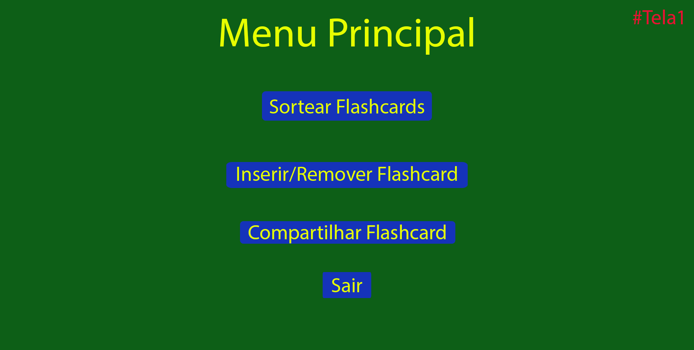

# Proposta Inicial de Aplicacao

Abaixo segue uma descrição de como a equipe visualizou o funcionamento da aplicação.

---

## Tela 1

O aplicativo é inciado e exibe a tela1:

Dentro dessa tela, o usuário pode selecionar uma das 4 opções:

1. Sotear Flashcards leva o usuário para a tela 2
2. Inserir/Remover Flashcard leva o usuário para a tela 4
3. Compatilhar Flashcard leva o usuário para a tela 5
4. Sair fecha a aplicação

---

## Tela 2

Dentro da tela 2, o usuário seleciona qual conjunto de grupos ele irá revisar. 

- Ao selecionar um dos conjuntos, o usuário é levado para a tela 3.
    - Se o usuário tiver menos que 10 *flashcards* registrados (registro em servidor), ele receberá um aviso "Não existem *flashcards* suficientes" e ele será levado para a tela 1.
- Se o usuário selecionar o botão com um "x", ele é levado para a tela 1.

---

## Tela 3

Ao carregar a tela 3, a aplicação irá carregar todos os *flashcards* correspondentes aos grupos selecionados na tela 2 pertentes ao usuário (carregado do servidor).

Na tela 3, o usuário pode percorrer os *flashcards* utilizando as setas amarelas. 

O usuário poderá também usar o botão de "360°" para virar o *flashcard*. 

Os botões "Errei..." e "Lembrei!" podem ser utilizados pelo usuário para que o *flashcard* em questão seja movido para o primeiro grupo, ou para o próximo grupo repectivamente. Nesse caso, o *flashcard* é removido visualmente da roleta.

Se o usuário selecionar o botão com um "x", ele é levado para a tela 2. As alterações feitas pelo usuário (lembrou ou não dos *flashcards*) serão descartadas.

Se o usuário remover todos os *flashcards* da roleta, as alterações feitas por ele serão salvas, uma mensagem irá aparecer avisando quantos flashcards ele conseguiu lembrar corretamente e ele será levado para a tela 2.

---

## Tela 4

Ao carregar a tela 4, a aplicação irá carregar todos os *flashcards* de todos os grupos pertentes ao usuário (carregado do servidor).

Na tela 4, o usuário pode percorrer os *flashcards* utilizando as setas amarelas. 

O usuário poderá também usar o botão de "360°" para virar o *flashcard*. 

O botão "Remover" pode ser usado para que o *flashcard* em questão seja removido da roleta, e conjunto geral de *flashcards* do usuário (removido do servidor). Se já não houverem mais *flashcards* para serem removidos, o botão não fará nada quando pressionado.

O botão "Inserir" ao ser selecionado fará com que uma caixa de texto apareça para que o usuário digite o conteúdo da frente do *flashcard*. Ao preencher a caixa de texto, uma nova caixa de texto irá aparecer permitindo que o usuário preencha as informações do verso do *flashcard*. Após a segunda caixa de texto ser preenchida, o *flashcard* é salvo no grupo 1 do usuário (salvo no servidor). Caso o número de *flashcards* alcance um limite estabelecido, o botão não fará nada quando pressionado.

Se o usuário selecionar o botão com um "x", ele é levado para a tela 1.

---

## Tela 5

Ao carregar a tela 5, a aplicação irá carregar todos os *flashcards* de todos os grupos pertentes ao usuário (carregado do servidor).

Na tela 5, o usuário pode percorrer os *flashcards* utilizando as setas amarelas. 

O usuário poderá também usar o botão de "360°" para virar o *flashcard*. 

Ao selecionar o botão "Compartilhar", uma caixa de texto irá aparecer onde o usuário irá colocar o ID de outro usuário. Ao completar o texto, a aplicação irá clonar o *flashcard* para o usuário com o ID inserido (registro no servidor). 
- Se a aplicação não encontrar o ID de usuário, uma mensagem irá aparecer pedindo que um ID válido seja colocado.

Se o usuário selecionar o botão com um "x", ele é levado para a tela 1.
