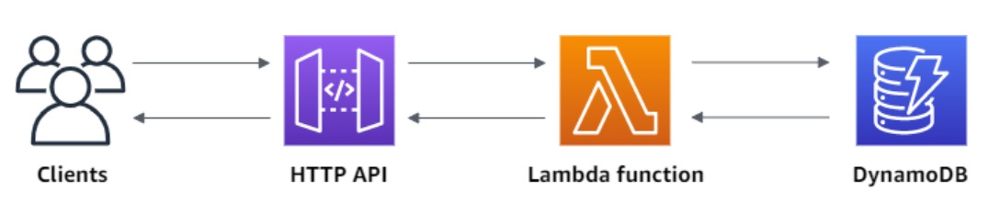
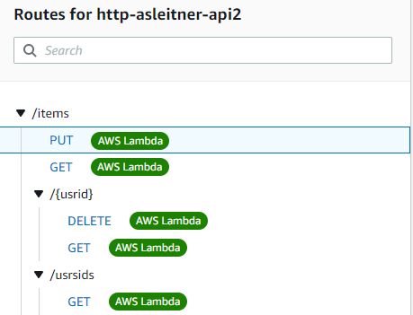
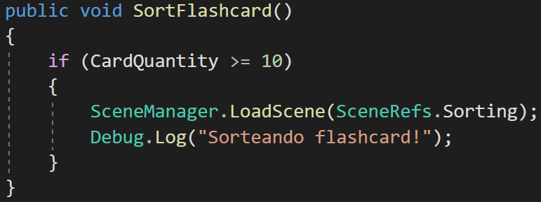
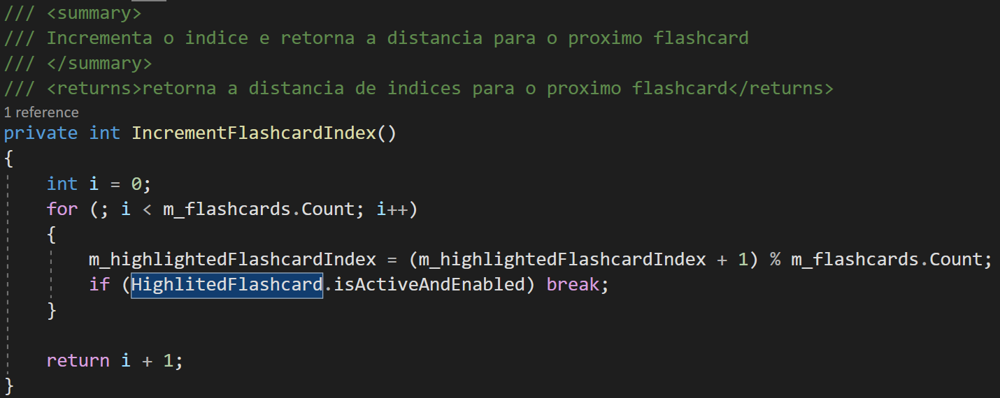
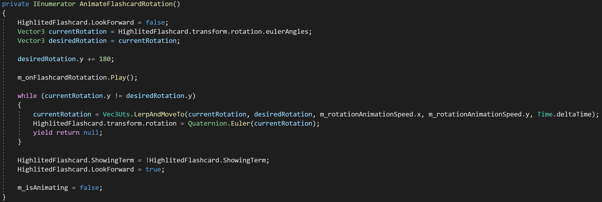

# Leitner - Projeto de Arquitetura de Software

## 1. Grupo
### 1.1 Integrantes: 
    
- Arthur Naves Pedroso - Integrador de sistemas & Arquiteto de sistemas
- Caio Henrique Portella - Guru da linguagem
- Luiz Eduardo Ramirez - Gerente do grupo
- Mauricio Macedo Villarnobo - Testador

---

## 2. Ferramentas
### 2.1 Desenvolvimento de software:


- **Vantagens:** 
  1. Facilidade na distribuição da aplicação para múltiplas plataformas;
  2. Editor _potente_ que dá amplo suporte para assets 2D e 3D;
- **Desvantagens:** O motor da Unity é muito grande, o que resulta em executáveis com tamanhos excessivos;

<br/><br/>

 


<br/><br/>

- Vantagens: 
  1. Serverless;
  2. Automaticamente escalonável;
  3. _Muito_ simples de utilizar;
- Desvantagens: Torna-se um custo após certo período;
<br></br>

- Ferramentas organizacionais:
 ---print do Git e do Trello---

2.2 Como elas modificaram a arquitetura do projeto:

---
### **3** Soluções para os requisitos da aplicação:
1. Carregar um conjunto contendo 10 **Flashcards**, pelo menos;
    
    Quando a aplicação for iniciada no dispositivo do usuário, uma requisição será feita para o servidor, de modo que, a existência do registro do id do usuário (ID único de dispositivo) será verificada. Caso o registro exista, a aplicação tentará carregar o baralho correspondente a esse usuário. Caso ele não exista, o usuário será registrado no servidor.

    Esse processo de carregamento de baralho foi alcançado com o uso de ferramentas da "AWS". 

    
    
    <br></br>

    - Requisições http enviadas para o servidor são roteadas através do "API Gateway" para uma função "lambda":

    

    
    <br></br>
    - A "função lambda" acessa o banco de dados "Dynamo DB" e retorna a tabela requisitada. A seguir um trecho do código do "lambda":

    ``` js
     switch (event.routeKey) {
      case "DELETE /items/{usrid}":
        await dynamo
          .delete({
            TableName: "http-asleitner-decks",
            Key: {
              usrid: event.pathParameters.usrid
            }
          })
          .promise();
        body = `Deleted item ${event.pathParameters.usrid}`;
        break;
      case "GET /items/usrsids":
        body = await dynamo
          .scan({
            TableName: "http-asleitner-decks",
            ProjectionExpression : 'usrid'
          })
          .promise();
        break;
      case "GET /items/{usrid}":
        body = await dynamo
          .get({
            TableName: "http-asleitner-decks",
            Key: {
              usrid: event.pathParameters.usrid
            }
          })
          .promise();
        break;
      case "GET /items":
        body = await dynamo.scan({ TableName: "http-asleitner-decks" }).promise();
        break;
      case "PUT /items":
        let requestJSON = JSON.parse(event.body);
        await dynamo
          .put({
            TableName: "http-asleitner-decks",
            Item: {
              usrid: requestJSON.usrid,
              deck: requestJSON.deck,
            }
          })
          .promise();
        body = `Put item ${requestJSON.usrid}`;
        break;
      default:
        throw new Error(`Unsupported route: "${event.routeKey}"`);
    }
    ´´´
    
O usuário só poderá entrar em sessões de aprendizado caso seu baralho tenha pelo menos 10 **Flashcards**. Se não for o caso, o usuário só pode entrar na visão de baralho, onde ele poderá adicionar mais **Flashcards**. Para alcançar esse requerimento, o controlador do menu principal verifica a quantidade de cartas do usuário com o "PlayerDataManager", que retém estado durante o fluxo de cenas da aplicação.



2. Virar um **Flashcard** a cada solicitação do usuário;

    Quando o usuário acessa a tela de escolha de menu de aprendizagem, ele terá a visão de baralho em que haverá um **Flashcards**, sendo que, um **Flashcards** irá possuir um termo, o qual é a materialização de um item de conhecimento que é definida pela caracterização do item de conhecimento.


3. Passar para outro **Flashcard** a pedido do usuário;

    A aplicação implementa uma roda mágica que consiste em organizar os **Flashcards** em formato de anel onde o usuário poderá percorrer pelas cartas e escolher seu **Flashcard**.

    Para passar para o proximo flashcard, a aplicação incrementa ou decrementa o indice do array de flashcards, ignorando os flashcards removidos.

    
    

    ////dentro das visoes de baralho e aprendizado isso é possivel, explicar a roda magica? falar que na visao de aprendizado tbm eh possivel pesquisar flashcards

4. Sortear um **Flashcard**, quando o usuário desejar;

    Dentro das condições de que o usuário está cadastrado e que possui um baralho válido, ele poderá assumir a visão de aprendizado em que o usuário poderá escolher entre 3 sessões, caso elas estejam populadas por **Flashcards**, essas sessões são: Ignorância, conhecimento parcial e conhecimento completo. Quando uma sessão é escolhida um dos **Flashcards** que ela possui é sorteado para ser avaliado.
    //descrever o sorteio na visao de aprendizado

5. Mostrar quantos **Flashcards** o usuário corretamente se lembrou;

    Em uma sessão de aprendizado, após o usuário terminar a avaliação dos **Flashcards**, ele poderá encerrar a sessão. Quando uma sessão é encerrada, a aplicação mostrará para o usuário quantos flashcards ele se lembrou. Em seguida os **Flashcards** lembrados passarão para próxima sessão e os esquecidos voltarão para sessão de ignorância. 
 
    //descrever interface na visao de aprendizado
    
6. Suportar a inserção e remoção de **Flashcards**;

    O usuário, caso possua um baralho, pode entrar na visão de baralho onde ele vai ter a possibilidade de percorrer o mesmo, inserir ou remover um **Flashcard**, virar um  **Flashcard**, e buscar um **Flashcard**.

    //descrever visao de baralho

7. Ser executado em desktops e celulares;

    A ferramenta de desenvolvimento Unity que usamos no projeto tem suporte a portabilidade entre dispositivos e sistemas diferentes sem a necessidade de uma alteração na arquitetura ou desenvolvimento.

    //Uso da ferramenta unity e arquitetura com cliente e servidor

8. Permitir que um usuário troque **Flashcards** com outro usuário;

    A ferramenta de desenvolvimento Unity fornece uma funcionalidade de geração de ID único para cada usuário, baseado em sua máquina. Os ID serão utilizados no cadastro e reconhecimento de usuários, além da identificação de seus baralhos, assim possibilitando sua cópia (troca de baralho) através do uso de um servidor AWS.

    //Descrever como um usuario pode ser selecionado pelo seu id unico para absorção de baralho (tela de troca de baralho)

9. A aplicação deverá “animar” um **Flashcard** sempre que ele for virado;

    A ferramenta de desenvolvimento Unity dá suporte a animações e interações gráficas da aplicação.

    Usando a ferramenta unity, a rotação foi alcançada através de interpolações lineares no "transform" dos objetos:
    


10. Basear-se na proposta de Leitner1 quando fizer o sorteio de **Flashcards**.

    A proposta de Leitner se resume em um método de memorização através de **Flashcards** onde existem caixas que dividem os **Flashcards** em níveis de aprendizado, a cada sessão de estudo o estudante verifica a caixa correspondente a sessão, além das anteriores a mesma e passa os **Flashcards** que lembra para caixa seguinte a qual eles se encontram e os que esquece a primeira caixa respectivamente, esse processo é repetido até todos **Flashcards** serem memorizados, ou seja, chegarem na última caixa.

    Em nosso projeto, instauramos uma visão do modelo de Leitner em que existem 3 caixas, ou sessões de aprendizado (ignorância, parcial e completo), em que cada sessão o usuário marca se lembrou ou não dos conceitos do **Flashcard** e após marcar todos e finalizar a sessão, eles são movidos para próxima caixa ou para primeira dependendo de suas respetivas marcações.
    
    //Descrever leitner
## 3 Modularização do Software

### 1. MonoSinglenton

```cs
    public abstract class MonoSingleton<SingletonClass> : MonoInstance where SingletonClass : MonoSingleton<SingletonClass>
    {
        [SerializeField] private bool m_dontDestroyOnLoad;
        
        private static SingletonClass s_instance;

        public static SingletonClass Instance 
        {
            get 
            {
                if (s_instance == null)
                {
                    s_instance = FindObjectOfType<SingletonClass>();
                }
                if (s_instance == null)
                {
                    Debug.LogWarning("Nenhuma instancia do objeto encontrada, instanciando novo objeto...");
                    s_instance = new GameObject(typeof(SingletonClass).Name).AddComponent<SingletonClass>();
                }
                return s_instance;
            }
        }

        public bool WillNotDestroyOnLoad { get { return m_dontDestroyOnLoad; } }

        protected virtual void Awake()
        {
            if (s_instance != null) 
            {
                Debug.LogError("More than one instance of "+ name +" found!!!");
                Destroy(gameObject);
                return;
            }
            s_instance = (SingletonClass)this;
            if(m_dontDestroyOnLoad) DontDestroyOnLoad(gameObject);
        }
    }
```
### 2. PlayerDataManager

```cs
public class PlayerDataManager : MonoSingleton<PlayerDataManager>
{
    private void CheckUsrRegistry();
    private void RegisterUserOnServer(int _requests = 0);
    private void TryToDownloadAndMergeDeckData(Action<bool> _mergeResult, string _usrID, int _requests = 0);
    private void TryToDownloadDeckData(int _requests = 0);
    private Dictionary<string, FlashcardData> CreateFlashcardDictionary(DeckData _deck);
    private void AddDeckDataToDict(Dictionary<string, FlashcardData> _dict, DeckData _deckData);
    private DeckData DictionaryToDeck(Dictionary<string, FlashcardData> _dict);

    public void SetFlashcard(string _oldKey, FlashcardData _flashcard);
    public FlashcardData GetFlashcard(string _key);
    public void AddNewFlashcard(FlashcardData _flashcard);
    public void DeleteFlashcard(string _key);       
    public void SaveFlashcards(Action _onUploadCompleted);
    public void ResetFlashcards();
    public void MergeDecks(string _usrId, Action<bool> _mergeDeckResultCB);
}
```


### 3. ServerComs

```cs

        public static IEnumerator GetUserDeckAsync(string _usrID, Action<DeckData, UnityWebRequest.Result> _onDownloadFinished, Action<float> _onDownloadUpdate)
        {
            DeckData deckData = null;
            using (UnityWebRequest getRequest = UnityWebRequest.Get(s_servrUrl + "/" + _usrID))
            {
                DownloadHandler downloadHan;
                getRequest.SendWebRequest();

                while (!getRequest.isDone)
                {
                    _onDownloadUpdate(getRequest.downloadProgress);
                    yield return null;
                }

                if (getRequest.error != null)
                {
                    Debug.LogError(getRequest.error);

                    _onDownloadFinished(deckData, getRequest.result);
                }
                else
                {
                    downloadHan = getRequest.downloadHandler;

                    deckData = JsonUtility.FromJson<PlayerDataGetReponse>(downloadHan.text).Item.deck;

                    _onDownloadFinished(deckData, getRequest.result);
                }
            }
        }

        public static IEnumerator SetUserDeckAsync(string _usrID, DeckData _usrData, Action<UnityWebRequest.Result> _onUploadFinished, Action<float> _onUploadUpdate)
        {
            PlayerData playerData = new PlayerData(_usrID, _usrData);
            using (UnityWebRequest setRequest = UnityWebRequest.Put(s_servrUrl, JsonUtility.ToJson(playerData)))
            {

                setRequest.SetRequestHeader("Content-Type", "application/json");
                setRequest.SendWebRequest();

                while (!setRequest.isDone)
                {
                    _onUploadUpdate(setRequest.uploadProgress);
                    yield return null;
                }

                if (setRequest.error != null)
                {
                    Debug.LogError(setRequest.error);
                }

                _onUploadFinished(setRequest.result);
            }
        }
        public static IEnumerator GetUsersIdsAsync(Action<string[], UnityWebRequest.Result> _onDownloadFinished, Action<float> _onDownloadUpdate)
        {
            using (UnityWebRequest getRequest = UnityWebRequest.Get(s_servrUrl + "/usrsids"))
            {
                UsrsIdsGetResponse usrsIdsResponse = null;
                string[] usrsIds = null;
                DownloadHandler downloadHan;
                getRequest.SetRequestHeader("Content-Type", "application/json");
                getRequest.SendWebRequest();


                while (!getRequest.isDone)
                {
                    _onDownloadUpdate(getRequest.downloadProgress);
                    yield return null;
                }

                if (getRequest.error != null)
                {
                    Debug.LogError(getRequest.error);

                    _onDownloadFinished(usrsIds, getRequest.result);
                }
                else
                {
                    downloadHan = getRequest.downloadHandler;

                    usrsIdsResponse = JsonUtility.FromJson<UsrsIdsGetResponse>(downloadHan.text);
                    usrsIds = new string[usrsIdsResponse.Count];
                    for (int i = 0; i < usrsIdsResponse.Count; i++)
                    {
                        usrsIds[i] = usrsIdsResponse.Items[i].usrid;
                    }

                    _onDownloadFinished(usrsIds, getRequest.result);
                }
            }
        }
```

### 4. RoletaMagica

```cs
public class MagicalRouletteCtrl : MonoBehaviour
    {
        private List<Flashcard> m_flashcards;
        private bool m_isAnimating;
        private int m_highlightedFlashcardIndex;

        public Flashcard HighlitedFlashcard;
        public bool IsAnimating;
        void Awake();
        private int IncrementFlashcardIndex();
        private int DecrementFlashcardIndex();
        private float GetAngleBetweenFlashcards();
        private void AssingFlashcardsPositions();

        private IEnumerator AnimateRouletteToIndex(int _desiredIndex);
        private IEnumerator AnimateRoulette(bool _rotatingRight);
        private IEnumerator AnimateFlashcardRotation();
        private IEnumerator AnimateFlashcardRotationAndRoulette(bool _rotateRight);
        private IEnumerator AnimateFlashcardRemoved();
        private IEnumerator AnimateFlashcardInserted();

        public void InsertNewFlashcard();
        public void InstantiateFlashcards(FlashcardData[] _flashcards);
        public void AnimateLeft();
        public void AnimateRight();
        public void RemoveHighlightedFlashcard();
        public void RotateCurrentFlashcard();
        public void RotateToFlashcard(FlashcardData _flashcardData);
    }
```
### 5. FlashcardData
```cs
    public class FlashcardData
    {
        [SerializeField] private string m_cardFront;
        [SerializeField] private string m_cardBack;
        [SerializeField] private LearningStages m_learningStage;

        public FlashcardData(string _cardFront, string _cardBack, LearningStages _learningStage)
        {
            if (_cardFront.Length > 120) throw new Exception("Termo com caracteres em excesso");
            if (_cardBack.Length > 430) throw new Exception("Definicao com caracteres em excesso");
            m_cardFront = _cardFront;
            m_cardBack = _cardBack;
            m_learningStage = _learningStage;
        }

        public string CardFront{ get => m_cardFront; } //max 120 chars 
        public string CardBack{ get => m_cardBack; } //max 430 chars
        public LearningStages LearningStage{ get => m_learningStage; }
    }
```

### 6. Flashcard
```cs
        [SerializeField]
        private TextMeshPro m_termo;
        [SerializeField]
        private TextMeshPro m_definicao;
        [SerializeField]
        private Color m_ignoranceColor;
        [SerializeField]
        private Color m_superficialColor;
        [SerializeField]
        private Color m_acquiredColor;
        [SerializeField]
        private Renderer m_rendererBack;
        [SerializeField]
        private Renderer m_rendererFront;
        public bool ShowingTerm;
        public bool LookForward;
        public FlashcardData FlashcardData { get; private set; }

        private void Start();
        private void Update();
        private void RotateForward();
        public void SetFlashCard(FlashcardData _flashcardData);
        public void SetTermVisibility(bool _setValue);
        public void SetDefinitionVisibility(bool _setValue);
```