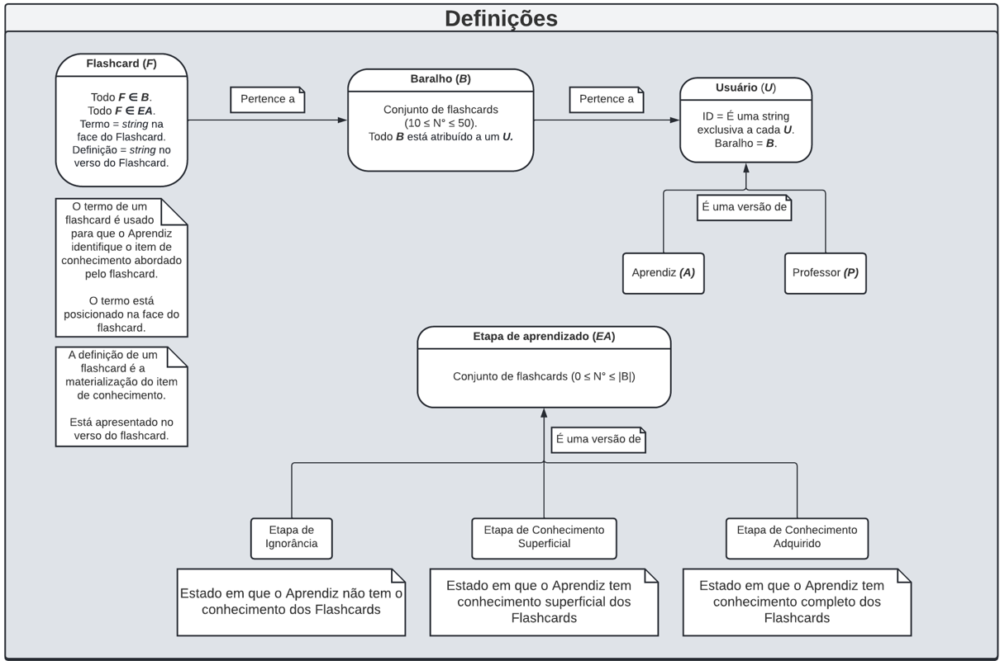

# Documentacao Técnica

## **1** Ferramentas e processos

### **1.1** Versionamento de arquivos
### **1.2** Estilo de programação
### **1.3** Processos organizacionais

---

## **2** Arquitetura

Abaixo está descrita a vista lógica da aplicação em um esquema produzido a partir de uma linguagem criada pela a equipe.

### **2.2** Definições

//Descrever quais são os elementos definidos

### **2.3** Visão de Baralho

//Descrever rapidamente que nessa tela podem ser criados, editados e deletados os **Flashcards** 

### **2.4** Visão de Aprendizado

(Errata: O esquema possui um erro onde **Flashcards** pertencentes a sessão de aprendizado avançado e que foram esquecidos regridem para a etapa de conhecimento superficial. Na realidade, o **Flashcard** deve retornar para a etapa de ignorância)

//Descrever as etapas que irão existir e sistema de leitner

### **2.5** Envio de **Flashcards**

//Descrever como o  sistema de "merge" de baralho ira funcionar e o sistema de comparilhamento de baralhos

---

### **3** Soluções para os requisitos da aplicação:
1. carregar um conjunto contendo 10 flashcards, pelo menos;
    
    Quando a aplicação for iniciada no dispositivo do usuário, uma requisição será feita para o servidor, de modo que, a existência do registro do id do usuário (ID único de dispositivo) será verificada. Caso o registro exista, a aplicação tentará carregar o baralho correspondente a esse usuário. Caso ele não exista, o usuário será registrado no servidor.
    
    O usuário só poderá entrar em sessões de aprendizado caso seu baralho tenha mais de 10 **Flashcards**. Se não for o caso, o usuário só pode entrar na visão de baralho, onde ele poderá adicionar mais **Flashcards**.
2. virar um flascard a cada solicitação do usuário;
    //dentro das visoes de baralho e aprendizado isso é possivel, explicar termo e definicao
3. passar para outro flashcard a pedido do usuário;
    ////dentro das visoes de baralho e aprendizado isso é possivel, explicar a roda magica? falar que na visao de aprendizado tbm eh possivel pesquisar flashcards
4. sortear um flashcard, quando o usuário desejar;
    //descrever o sorteio na visao de aprendizado
5. mostrar quantos flashcards o usuário corretamente se lembrou;
    //descrever interface na visao de aprendizado
6. suportar a inserção e remoção de flashcards;
    //descrever visao de baralho
7. ser executado em desktops e celulares;
    //Uso da ferramenta unity e arquitetura com cliente e servidor
8. permitir que um usuário troque flashcards com outro usuário;
    //Descrever como um usuario pode ser selecionado pelo seu id unico para absorção de baralho (tela de troca de baralho)
9. a aplicação deverá “animar” um flashcard sempre que ele for virado;
    //UNITy da suporte a animacao
10. basear-se na proposta de Leitner1 quando do sorteio de flashcards.
    //Descrever leitner